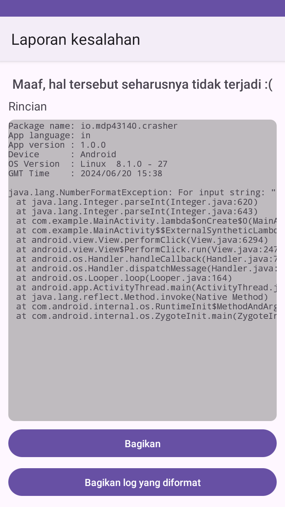
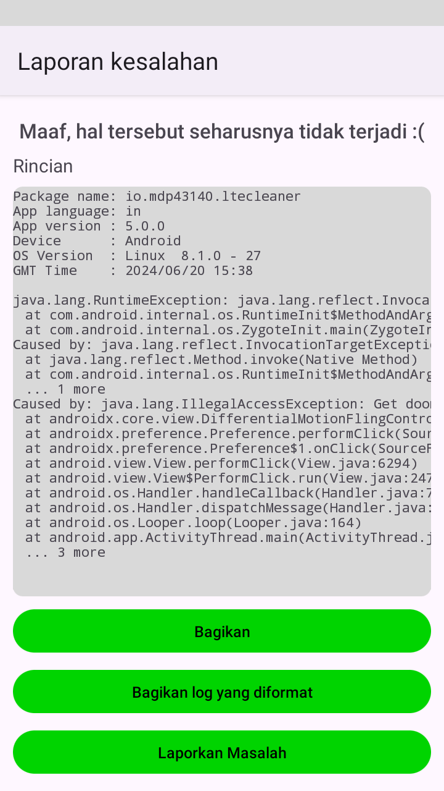
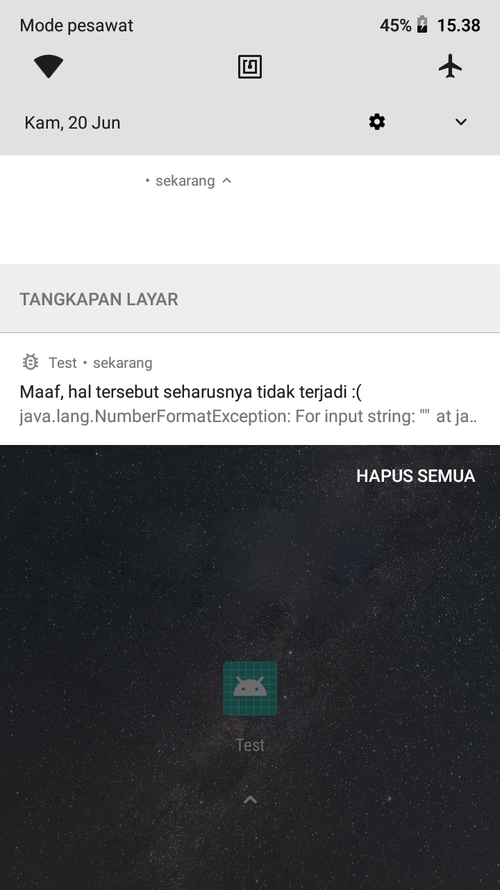

# Android Error Logger (AEL)
Yet another error logger for
your beloved Android apps

[](https://github.com/MDP43140/ael/issues)
[](/LICENSE)

## Features:
+ Easy-to-implement (see Usage section)
+ Lightweight
+ Lite version available for smaller apk size (Doesn't use AndroidX & Kotlin)
+ Able to display light/dark theme (depends on theme implementation, lite
	version depends on device: likely will use dark theme by default)
+ Customizable (shows Toast, sends Notification, launches Activity.
	customize ErrorActivity theme or even its whole UI and mechanisms)
- Known issue: Notification crash didnt show new log

## Screenshots:




## Usage:
AndroidErrorLogger is available at JitPack's Maven repo, or as standalone .aar file in releases section.

If you're using Gradle, you could add AndroidErrorLogger with the following steps:

Add `maven("https://jitpack.io")` to the `repositories` in your `build.gradle.kts`.

Add `implementation("com.github.mdp43140.ael:VARIANT:VERSION")` to the `dependencies` in your `build.gradle.kts`.

Replace `VERSION` with [release version](/releases) or [any commit](/commits).

There are 3 `variant`s:
- `ael-compose` (uses Kotlin + Compose, modern experimental variant, preferred for compose-only apps)
- `ael-kt` (uses Kotlin + AndroidX, preferred variant, recommended for non-compose apps)
- `ael-lite` (Doesn't use AndroidX + Kotlin, lightweight, no extra dependency)

See the included demo for how to use and more:
Initialize global error catcher (recommended for majority of use-cases):
- [App (Kotlin)](/app/src/main/java/com/example/App.kt)
- [App (Java)](/app/src/main-java/java/com/example/App.kt)

Crasher code example, with try-catch:
- [MainActivity (Kotlin)](/app/src/main/java/com/example/MainActivity.kt)
- [MainActivity (Java)](/app/src/main-java/java/com/example/MainActivity.kt)

### Code "optimization"
If you're using ProGuard (or any other obfuscation/"optimization" tricks),
you may want to disable some parts of it (specifically stacktrace related),
For ProGuard, first of all, add this line in your app/build.gradle: ```kotlin
android {
	buildTypes {
		release {
			proguardFiles(getDefaultProguardFile("proguard-android-optimize.txt"), "proguard-rules.pro")
		}
		// you may want to apply the same to other build types...
	}
}```, then add this line to your app/proguard-rules.pro: ```proguard
-dontobfuscate
-keepattributes SourceFile,LineNumberTable```

## Further customizations (overriding default codes)
If you want to customize `ErrorActivity` which is provided by default for ease-of-use sake, keep in mind that it receives `Intent` with extra string message `Constants.EXTRA_MESSAGE`
other codes should not be modified, and should use the default
Activities made by this library uses style `AEL_Theme` which inherits from `Theme.Material3.DayNight` or `Theme.Material` for lite version
you can make it inherit your theme to make it more coherent with your whole app

## TODO:
- Compose variant
- Pressing error report from notification wont show latest error (sometimes empty?)
	(eg. error A occurred, user pressed notification, sees error A, later error B
	occured, user pressed notification, but instead of seeing error B, user still sees
	error A), need full reboot or full clean reinstall of the app

## License
[](https://www.gnu.org/licenses/gpl-3.0.en.html)

AndroidErrorLogger library is Free Software: You can use, study, share, and improve it at
will. Specifically you can redistribute and/or modify it under the terms of the
[GNU General Public License](https://www.gnu.org/licenses/gpl.html) as
published by the Free Software Foundation, either version 3 of the License, or
(at your option) any later version.
